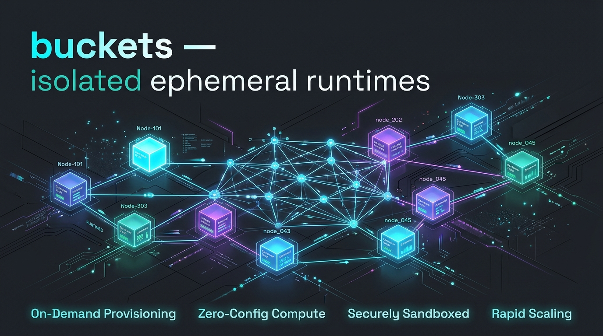

# buckets

<p align="center">
  
</p>

**Throwaway runtime buckets for AI agents.**

Resolve, fetch, and run any CLI tool in an isolated ephemeral environment —
without installing it globally.

Borrowing concepts from [pkgx](https://pkgx.dev) (bottle format, dist server,
env composition, companion deps) and [exosphere](https://github.com/nixpulvis/exosphere)'s
exo-hydra provisioning pipeline (resolve → install → compose → exec).

## Why buckets?

AI agents need ad-hoc runtimes: "run this with Node 20", "test this with
Python 3.11", "build with Go 1.22 + CMake". Installing these globally pollutes
the host and creates version conflicts.

**buckets** gives each command its own throwaway runtime — fetched on demand
from `dist.pkgx.dev`, cached locally, cleaned up when done.

## Using it from the squad fleet

Any agent with shell access (bro-cli's `bash` tool, a dispatched Claude Code
horse, any runner) can call `buckets` directly once it's on `PATH` — it's a
plain CLI, no MCP/tool registration needed. For concurrent fleet agents,
prefer `bucket-bridge` (`jokersquad/bin/bucket-bridge`, symlinked to
`~/.local/bin/`) over calling `buckets` directly: it's a transparent wrapper
that points every agent at one shared `BUCKETS_CACHE_DIR`
(`~/.cache/squadron-buckets`) instead of each agent maintaining its own
cache, so N agents resolving the same spec (`node@20`) don't each
redundantly download the same bottle. Safe under concurrency — see
`install.rs`'s atomic-rename install.

## Usage

```bash
# Run one-off commands
buckets run node@20 -- script.js --flag arg
buckets run python@3.11 -- -c "print('hello from a bucket')"
buckets run rust@latest -- rustc --version

# Multi-package environments
buckets run node@20 python@3.11 -- node -e "console.log('and python is at', process.env.PATH)"
buckets run go@1.22 cmake@latest -- go version

# Open an interactive shell with the runtime in PATH
buckets shell node@20
buckets shell python@3.11 --shell /bin/zsh

# Print the composed environment as shell exports (composable)
eval "$(buckets env node@20)"
buckets env node@20 python@3.11 --json

# See what a spec resolves to (no installation)
buckets info node@20
buckets info git@latest

# List cached installations
buckets list

# Build/test/run a real project — clone (git URL) or use (local path),
# detect the build system, resolve the toolchain it needs, build inside
# a sandboxed bucket. Doesn't touch the host filesystem outside the
# project dir + the resolved toolchain's own cache.
buckets build /path/to/repo
buckets build https://github.com/owner/repo --test
buckets build . --test --run

# Ephemeral worktrees — a task gets its own working copy at a fresh
# branch (git worktree add, not a full clone — cheap, shares the repo's
# object store). Build/test it like any other local path. "Destroyed
# once you merge": removing an unmerged worktree's branch is refused by
# git itself (git branch -d's own safety check) unless --force.
buckets worktree create /path/to/repo my-task-branch
buckets build "$(buckets worktree create /path/to/repo my-task-branch)" --test
buckets worktree remove /path/to/repo /path/to/repo-my-task-branch my-task-branch
buckets worktree list /path/to/repo

# GUI buckets — run a GUI app against a fresh, isolated Xvfb X server
# (not the host's real display). Only the throwaway server's own socket
# + a session-scoped Xauthority cookie are visible inside the sandbox.
buckets gui --screenshot /tmp/out.png --timeout 5 -- glxgears
buckets gui node@20 --width 1280 --height 800 -- node gui-script.js

# Site buckets — open a URL with a real, OS-enforced per-origin storage
# sandbox (revives the intent behind exosphere-apps' site-capsulizer,
# which was found unenforced scaffolding — see the README's "Site
# buckets" section below). Defaults to a headless browser binary
# (surfer) on PATH; --gui runs a windowed one (super-surfer) in a
# fresh Xvfb.
buckets site https://example.com
buckets site https://example.com --gui --screenshot /tmp/site.png --timeout 5
buckets site https://example.com --incognito   # ephemeral storage, removed on exit
```

## Real process isolation

`run`/`shell`/`build` all execute under [bubblewrap](https://github.com/containers/bubblewrap)
(`bwrap`) — a fresh mount + PID namespace, not just an isolated toolchain
version. Only the resolved toolchain's own install dirs (read-only) and
the invocation/project directory (read-write) are visible inside; nothing
else on the host is. Network is off by default for `run`/`shell` (most
tool invocations don't need it) and on for `build` (package registries
do). Falls back to a plain unsandboxed subprocess with a warning if
`bwrap` isn't installed — use `--no-sandbox` to opt out explicitly.

## Real GUI isolation

`buckets gui` runs a GUI command against a brand-new [`Xvfb`](https://www.x.org/releases/X11R7.6/doc/man/man1/Xvfb.1.xhtml)
X server, not the host's real `:0`. Borrows the concept from
[x11docker](https://github.com/mviereck/x11docker) — a session-scoped
MIT-MAGIC-COOKIE Xauthority cookie, generated fresh per session and bound
into the sandbox alongside exactly ONE file (the specific `/tmp/.X11-unix/X<N>`
socket, never the whole directory) plus `DISPLAY`/`XAUTHORITY` env vars.
Deliberately a nested server, not a `--hostdisplay`-style reuse of the real
session — X11 has no native per-client window isolation, so a fresh `Xvfb`
instance means nothing on the real display is ever exposed. Verified live:
a client with the wrong/missing `XAUTHORITY` is refused by the X server
("Authorization required, but no authorization protocol specified");
the right cookie succeeds. Session cleanup (Xvfb process, socket, cookie
file) happens on drop regardless of how the command exited.

**vs. `squadron/bin/display-up`:** a lighter-weight sibling tool exists in
`squadron` for a different shape of problem — attaching automation
(`xdotool`/`import`, or interactd's `computer_use`/`vision_start`/
`atspi_start`) to an app you're launching yourself rather than sandboxing
a command *for* you. `display-up` allocates a per-agent Xvfb display
number (flock-serialized, idempotent, keyed by agent identity) but does
NOT provide `buckets gui`'s Xauthority-gated/bwrap-sandboxed containment
— any process that guesses the right `:N` can still connect. Use
`buckets gui`/`buckets site --gui` when you want the command sandboxed
too (real OS-level containment); use `display-up` when you just need a
private display surface to avoid colliding with another agent's session
on the shared host `:0` (the incident that motivated it: blind `xdotool`
automation during surfer-browser's SHELL-SPLIT-3 spammed input into
another agent's window). The two don't conflict — `buckets gui`'s
`XvfbSession` could reuse `display-up`'s allocation logic later if the
two ever want to converge, but that's not needed today.

## Site buckets

`buckets site <url>` runs a browser against a URL with a real, OS-enforced
per-origin storage sandbox — reviving the intent behind exosphere-apps'
`exo-site-capsulizer` (storage-capsule/net-capsule/worker-capsule), which
was found to be ~95% unenforced scaffolding (`check_request()` never
called, storage VFS dead code, workers never started) and replaced in
`surfer-browser` with a shim explicitly documented as "not an enforcement
layer" — real privacy there is a JS `fetch`/`XHR` interceptor, still
in-process, still not real OS isolation.

`buckets site` gets the enforcement for free from the sandboxing this
project already has: each host gets its own read-write bind
(`$BUCKETS_CACHE_DIR/sites/<host>/`, persistent — real browsing-profile
semantics — or `--incognito` for a tempdir removed on exit) and nothing
else on the host is visible inside the sandbox. Headless by default
(`surfer` on PATH); `--gui` runs a windowed browser (`super-surfer`) inside
a fresh Xvfb, same mechanism as `buckets gui`. Neither browser binary is
built by buckets itself — build it once in `surfer-browser` (`cargo build
--release -p surfer --features cli` for headless, `-p super-surfer
--features bliss` for GUI), then point `buckets site` at it (PATH lookup
by default, or `--browser-bin <path>`).

Not built: per-domain/third-party network filtering (still just the
existing coarse network on/off toggle) and building the browser binary
itself (a separate, one-time `cargo build`, not part of this command).

## Spec format

```
<tool>[@<version>]
```

| Spec | Meaning |
|---|---|
| `node@20` | Node.js 20.x (latest in `^20` range) |
| `python@=3.11.0` | Exact Python 3.11.0 |
| `rust@latest` | Latest stable Rust |
| `node` | Latest (same as `@latest`) |
| `go@^1.22` | Standard caret semver |
| `go@>=1.22` | Greater-or-equal |
| `rust@~1.70` | Tilde (patch-level) semver |

## Featured aliases (60+ tools)

| Alias | Resolves to |
|---|---|
| `node` | `nodejs.org` |
| `python` | `python.org` |
| `rust` | `rust-lang.org` |
| `go` | `golang.org` |
| `git` | `git-scm.com` |
| `cmake` | `cmake.org` |
| `ripgrep` / `rg` | `BurntSushi/ripgrep` |
| `curl` | `curl.se` |
| `gh` | `github.com/cli` |
| `docker` | `docker.com` |
| `kubectl` | `kubernetes.io/kubectl` |
| `terraform` | `terraform.io` |
| `aws` | `amazon.com/aws-cli` |
| `neovim` | `neovim.io` |
| `tmux` | `tmux.github.io` |
| ... and 45+ more | See `src/index.rs` |

## How it works

1. **Parse** spec → project + semver constraint
2. **Resolve** alias → full pkgx project name
3. **Collect companions** ��� auto-include deps (e.g. openssl for curl, cmake)
4. **Resolve versions** → check cache first, then remote `versions.txt`
5. **Install** → download `.tar.xz` bottle, XZ-decompress, extract, atomic rename
6. **Symlink** → create `v*`, `v<major>`, `v<major.minor>` → latest version
7. **Compose** env → PATH, LD_LIBRARY_PATH, CPATH from installation dirs
8. **Run** or **export** the environment

## Commands

| Command | Description |
|---|---|
| `run <specs> -- <cmd>` | Resolve, install, and exec a command |
| `shell <specs>` | Open an interactive shell with the runtime |
| `env <specs>` | Print shell exports (`--json` for structured output) |
| `info <specs>` | Show resolution without installing |
| `list` | Show cached installations |
| `build <path-or-url> [--test] [--run]` | Detect + build (+ test/run) a real project, sandboxed |
| `worktree create <repo> <branch> [--from <base>]` | Create an ephemeral worktree (prints its path) |
| `worktree remove <repo> <path> <branch> [--force]` | Remove a worktree + its branch (git refuses if unmerged, unless --force) |
| `worktree list <repo>` | List existing worktrees |
| `gui [specs] -- <cmd> [--screenshot <path>] [--timeout <secs>] [--width <N>] [--height <N>]` | Run a GUI command in a sandboxed bucket against a fresh Xvfb X server |
| `site <url> [--browser-bin <path>] [--gui] [--incognito] [--screenshot <path>] [--timeout <secs>]` | Open a URL with a real per-origin storage sandbox |

## Configuration

| Env var | Default | Description |
|---|---|---|
| `BUCKETS_DIST_URL` | `https://dist.pkgx.dev` | Distribution server URL |
| `BUCKETS_CACHE_DIR` | `~/.cache/buckets/` or `~/.buckets/` | Local cache directory |
| `BUCKETS_WORKTREE_DIR` | sibling of the source repo | Parent directory for `worktree create` (see below) |

`BUCKETS_WORKTREE_DIR` defaults to creating each worktree as a sibling of
its source repo (`/path/to/repo-my-branch` next to `/path/to/repo`), not
a fixed cache location — required for relative sibling path-dependencies
(`../other-repo`) to keep resolving correctly from inside the worktree.

## `--flare` — zram-backed cache instead of host disk

```bash
sudo flare-up --agent myagent --quiet   # once per session (needs root)
buckets --flare run node@20 -- node script.js
```

`--flare` points `BUCKETS_CACHE_DIR` at an already-provisioned zram-backed
ext4 mount (`squadron/bin/flare-up`) instead of host disk — same
resolve/install/sandbox pipeline, just backed by compressed RAM that
evaporates on reboot instead of accumulating on an SSD. Deliberately does
**not** provision a session itself: `flare-up` needs root and is meant to
be session-scoped (run once per agent/session, reused across many
`buckets` invocations), not re-provisioned per command. `--flare` errors
clearly if no session is live rather than silently falling back to host
disk — run `sudo flare-up` first. See
`/workspace/projects/FLARE_FIREFLY_DESIGN.md` for the full design and why
this doesn't repeat the earlier zram-for-inference performance problems.

## Features borrowed from pkgx

- **Bottle format**: `.tar.xz` from `dist.pkgx.dev/<platform>/<arch>/<project>/v<version>.tar.xz`
- **Cache layout**: `~/.buckets/<project>/v<version>/bin/...`
- **Symlink version scheme**: `v*` → latest, `v20` → latest v20.x.x
- **Companion packages**: auto-included deps (openssl for curl, etc.)
- **Env composition**: scan `bin/`, `lib/`, `include/`, `share/`, `man/` per installation
- **Shell exports format**: `export PATH="/path/to/bucket/bin:$PATH"`
- **JSON output**: `--json` for structured consumption
- **Multi-package**: `buckets run node@20 python@3.11 -- node -e "..."`

## Installation

```bash
cargo install --path .
```

## Acknowledgments

buckets is a clean-room reimplementation, not a fork — no source from the
projects below is copied here, only the formats/behaviors listed under
"Features borrowed from pkgx" above, plus the general
resolve→install→compose→exec pipeline shape.

- **[pkgx](https://github.com/pkgxdev/pkgx)** (Max Howell, Jacob Heider;
  Copyright 2022–23 pkgx inc.; Apache-2.0) — the bottle format, `dist.pkgx.dev`
  distribution protocol, cache/symlink layout, companion-package resolution,
  and env-composition approach are all pkgx's design, reimplemented here.
- **exosphere's `exo-hydra`** and **exo-light's `exo-hydra`** — the same
  pkgx-derived provisioning pipeline shape (resolve → install → compose →
  exec), adapted for this project's standalone/sync use case. See
  `/workspace/projects/CLAUDE.md`'s provisioning-lineage note for how the
  three relate.

**Real-world adoption note (2026-07-11):** of the three pkgx-derived
implementations above, `buckets` is currently the only one with real
downstream consumers — `interactd`'s `BucketsTool` (shells out to the
`buckets` CLI) and `flame`'s `flame-core::kindle` (a real compile-time
Rust dependency, `buckets = { path = "../../../buckets", optional = true }`,
one of flame's three "fuel" backends alongside local paths and language
registries — see flame's own README: *"Buckets remains the fleet
tool-bottle CLI; Flame is the workspace OS"*). Both `exo-hydra` copies
remain fully built but honestly self-documented as unwired (their own
READMEs say so) — resolve/install/manifest pipelines with no consumer
calling into them yet.

## License

MIT — see `LICENSE`. (Acknowledgments above are for design/format credit,
not a licensing obligation — no pkgx source is redistributed.)
